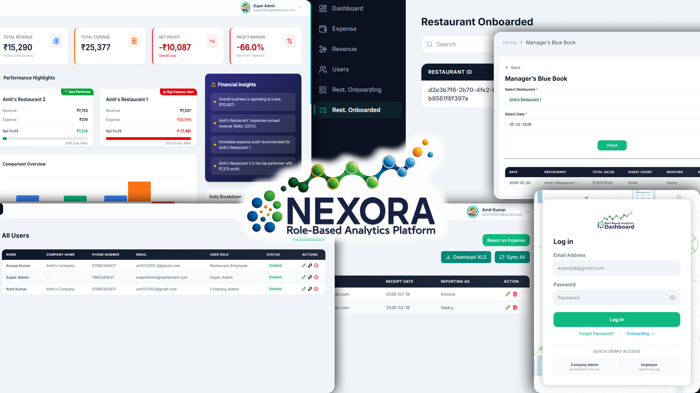
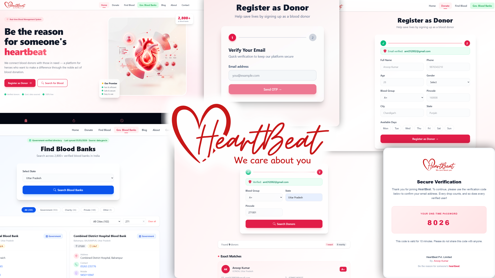

# Hi, <b>I'm Anoop Kumar</b> 👋

<b>Full-Stack Developer</b> | <b>Frontend Systems & Backend Architecture Engineer</b>  

<i>Building scalable, production-ready applications with clean architecture, optimized APIs, and modern, user-focused interfaces.</i>

---

## 🌐 <b>Connect With Me</b>

---

## 👨‍💻 <b>About Me</b>

<b>Computer Science Graduate (2021–2025)</b>

<i>I am a <b>Full-Stack Developer</b> specializing in building scalable, production-ready applications with a strong focus on both frontend experience and backend architecture.</i>

<b>I design systems that are:</b>
  - 🚀<b> Scalable</b> and modular
  - 🧩 <b> Maintainable</b> and cleanly structured
  - ⚡ <b> Performance-optimized</b>
  - 🏗️ Built for <b>real-world use cases</b>

<i>From crafting intuitive user interfaces to engineering robust backend systems, I focus on delivering complete, end-to-end solutions.</i>

<i>I enjoy working on complex problems involving <b>real-time systems</b>, <b>role-based architectures (RBAC)</b>, and <b>data-driven applications</b>.</i>

---

## 🎨 <b>Frontend Expertise</b>

- Modern UI development using React & Next.js
- Component-driven architecture
- Responsive and accessible design
- Performance optimization (lazy loading, code splitting)
- Clean state management patterns
- UI/UX consistency and design systems

---

## ⚙ <b>Backend Expertise</b>

- RESTful API architecture
- Role-Based Access Control (RBAC) systems
- Middleware-based request handling
- Database schema design & relationships
- Authentication & authorization flows
- Scalable folder structures
- Production deployment workflows

---

## 🛠 <b>Tech Stack</b>

### Languages & Tools

   

### Frontend & Design

   

### Backend & Databases

   

## 🚀 <b>Featured Projects</b>

### QueueFlow — Real‑Time Task Queue & Team Collaboration Platform

**🔗 Live:** [queue-flow-rho.vercel.app](https://queue-flow-rho.vercel.app/)

<i>QueueFlow is a real-time project management platform built for modern development teams. It connects Project Managers, Developers, and Clients inside shared live workspaces — with drag-and-drop Kanban boards, sticky-note feedback, a workflow intelligence analytics engine, and a real-time activity feed, all syncing instantly via WebSockets without a page refresh.</i>

---

### NEXORA — Multi-Tenant Role-Based Company Restaurants Management & Analytics Platform

**🔗 Live:** [role-based-analytics-dashboard.vercel.app](https://role-based-analytics-dashboard.vercel.app/)

<i>NEXORA is a scalable, role-based analytics platform designed to manage multi-tenant business operations with precision and clarity. It enables organizations to onboard multiple companies, each managing their own network of restaurants and employees within a unified system.</i>

<i>Built on a robust <b>RBAC (Role-Based Access Control)</b> architecture, the platform provides structured access for Super Admins, Company Managers, and Employees — ensuring secure and efficient data flow. With real-time dashboards, managers can track performance, monitor operational metrics, and make data-driven decisions, while employees seamlessly update daily workflows.</i>

<i>Designed for real-world scalability, NEXORA handles complex nested data such as revenue targets, labor costs, and COGS, making it a production-ready enterprise solution.</i>

---

### HeartBeat — Connecting Donors, Saving Lives and Finding Blood Banks

**🔗 Live:** [blood-management-system-frontend-rosy.vercel.app](https://blood-management-system-frontend-rosy.vercel.app/)

<i>HeartBeat is a modern, high-performance React-based platform designed to bridge the gap between voluntary blood donors and those in urgent need. By integrating real-time data from <b>official Government of India sources</b>, it provides precise search capabilities for verified blood banks and intelligent matching for local donors. Built with speed and responsiveness at its core, HeartBeat ensures that life-saving resources are always just a click away.

</i>

---

### The Secrets of CHIAROSCURO — Dark Fantasy Web Experience

**🔗 Live:** [secrets-of-chiaroscuro.vercel.app](https://secrets-of-chiaroscuro.vercel.app/)

<i>An immersive dark-fantasy web experience built to showcase the world of <b>"The Secrets of CHIAROSCURO"</b>. The website blends storytelling with modern web design, featuring cinematic visuals, character reveals, interactive lore sections, and a structured narrative flow.</i>

<i>Designed with a strong focus on atmosphere and user engagement, the site uses dynamic layouts, smooth transitions, and thematic color grading to reflect the conflict between light and shadow. It serves as both a storytelling platform and a branding experience for the novel.</i>

<i>This project highlights advanced frontend design, visual storytelling, and the ability to translate narrative depth into an interactive digital experience.</i>

---

## 📊 <b>GitHub Stats</b>

---

## 🚀 <b>Current Focus</b>

- Advanced Full-Stack System Design  
- Scalable Frontend Architecture  
- API Performance Optimization  
- Clean Code & Production Standards  
- Mastering System Design  

---

⭐ If you like my work, consider giving a star to my repositories.
